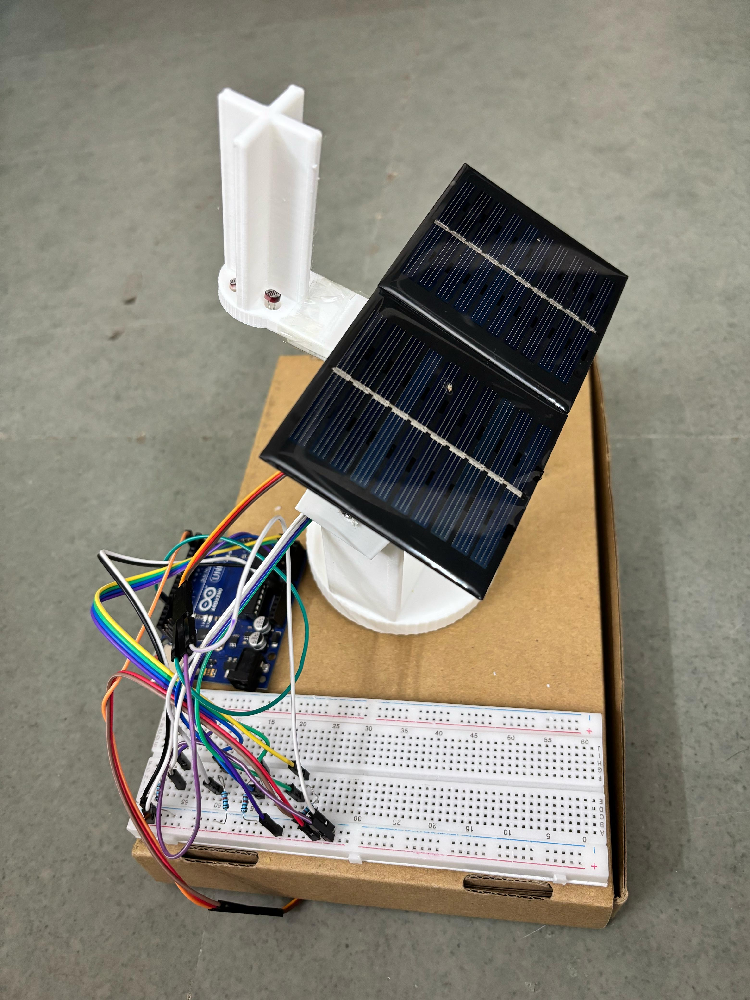

# **Dual-Axis Solar Tracker**

**Project**
- **Summary**: Designed an Arduino-based solar tracking system using LDR sensors and control logic for dynamic orientation.
- **Outcome**: Improved solar energy capture efficiency compared to static panel setups under real-world testing conditions.

**Features**
- **Dual-axis tracking**: Adjusts both horizontal and vertical servo motors for optimal sun alignment.
- **Sensor-based control**: Uses four LDR sensors to determine light direction and adjust orientation.
- **Safe limits**: Servo movement constrained by configurable high/low limits in the control code.

**Wiring (high level)**
- **Servos**: Horizontal servo connected to digital pin 2, vertical servo to digital pin 13.
- **LDRs**: Four LDR sensors connected to analog pins A0–A3 (see [main.ino](main.ino) for exact mapping).

**Usage**
- **Code**: See the main control sketch: [main.ino](main.ino)
- **Deploy**: Open the Arduino IDE, load the sketch, select the correct board and COM port, then upload.
